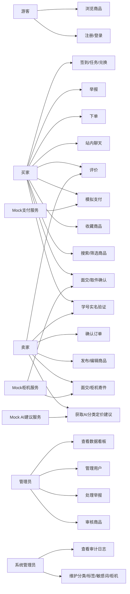
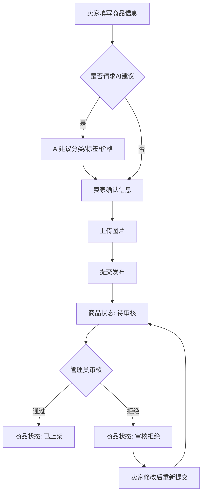
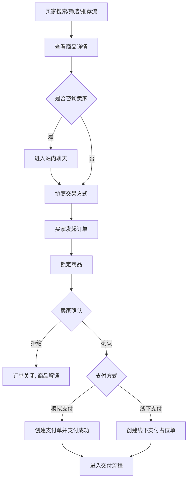
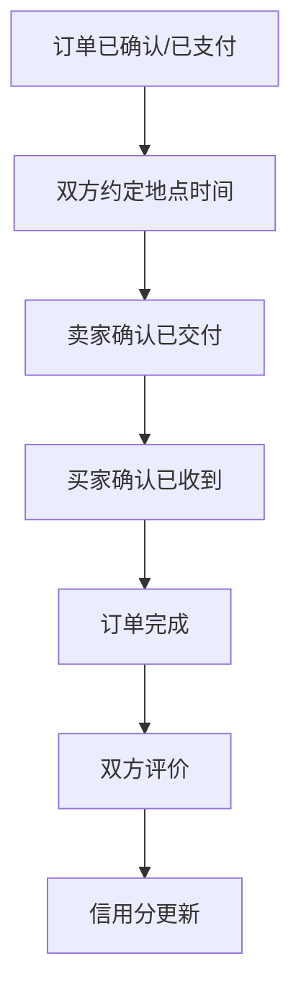
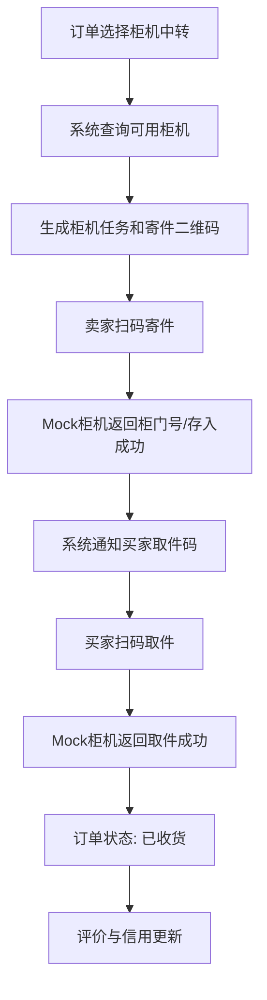
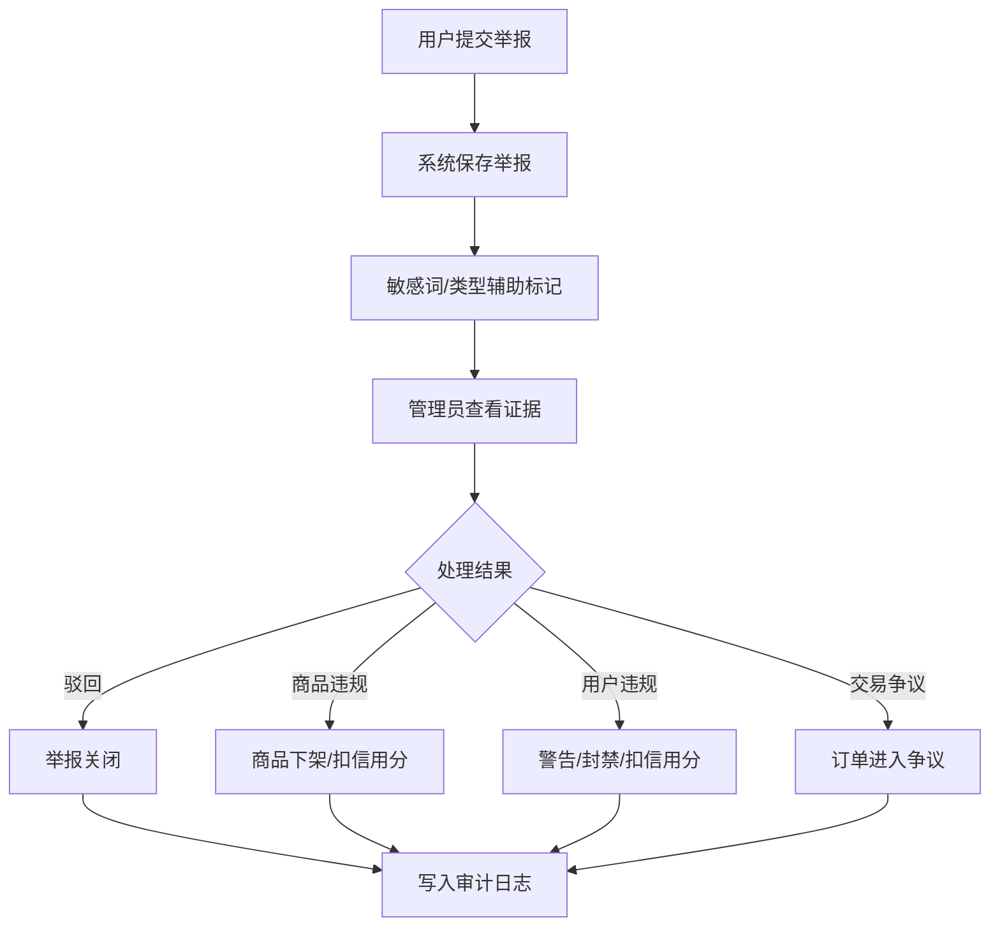

# T-02 SwapCampus D2-D3 需求规格、用例、流程与原型设计

版本：v1.0  
日期：2026-06-03  
适用范围：SRS、用例图、业务流程图、核心页面原型

## 1. 项目概述

SwapCampus 是面向本校师生的校园闲置物品交易平台。系统通过学号实名验证、信用分、站内沟通、交易评价、举报审核和管理员后台，替代微信群、朋友圈等分散交易方式，提升校内闲置物品流转效率与交易可信度。

本设计覆盖课程 T-02 的 6 个必做模块，并纳入全部附加项：

- 个性化推荐：基于浏览、收藏、下单、分类偏好的推荐流。
- AI 自动分类与定价建议：默认实现为规则/样例数据模拟接口，后续可替换真实 AI 服务。
- 校园柜机中转：支持扫码寄件、取件，默认实现为 Mock 柜机接口。
- 信用积分游戏化：签到、任务、积分兑换。
- 模拟支付：支持模拟支付、退款和支付流水，默认不接真实支付网关。

## 2. 业务目标

- 用户可发布、浏览、搜索、购买校园二手商品。
- 建立基于学号实名和信用分的可信用户体系。
- 买卖双方可通过站内即时通讯协商价格、地点、柜机中转等事项。
- 交易支持线下面交、柜机中转、模拟支付三种演示路径。
- 管理员可审核商品、处理举报、封禁违规用户，并查看运营数据。

## 3. 用户角色

| 角色 | 说明 | 主要权限 |
| --- | --- | --- |
| 游客 | 未登录访问者 | 浏览公开商品、查看商品详情、注册/登录 |
| 买家 | 已实名学生/教师 | 搜索、收藏、聊天、下单、支付、确认收货、评价、举报 |
| 卖家 | 已实名学生/教师 | 发布商品、编辑商品、接单、确认面交、柜机寄件、查看评价 |
| 管理员 | 平台运营人员 | 商品审核、举报处理、用户管理、看板查看 |
| 系统管理员 | 技术/配置维护人员 | 分类标签维护、柜机配置、审计日志、系统参数 |
| 外部服务 | Mock 支付、Mock 柜机、Mock AI | 通过适配器接口提供模拟服务 |

## 4. 功能需求

### M1 用户体系

| 编号 | 需求 |
| --- | --- |
| FR-M1-01 | 用户可使用手机号/邮箱/用户名注册，并使用密码登录。 |
| FR-M1-02 | 登录成功后系统签发 JWT，前端保存并用于后续接口鉴权。 |
| FR-M1-03 | 用户必须通过学号实名验证沙箱后，才可发布商品、下单、支付、评价。 |
| FR-M1-04 | 用户可维护头像、昵称、学院、年级、联系方式等个人资料。 |
| FR-M1-05 | 系统维护信用分，默认 60 分，完成交易、好评、违规、爽约均生成信用流水。 |
| FR-M1-06 | 用户可进行每日签到、完成任务、获得信用积分或游戏化积分。 |
| FR-M1-07 | 用户可查看个人主页、发布商品、历史订单、评价、信用记录。 |

### M2 商品发布

| 编号 | 需求 |
| --- | --- |
| FR-M2-01 | 卖家可发布商品，填写标题、描述、分类、标签、价格、成色、交易方式。 |
| FR-M2-02 | 商品支持多图上传，图片默认存入 MinIO，可降级为本地静态资源。 |
| FR-M2-03 | 商品发布后进入待审核状态，管理员审核通过后才对买家可见。 |
| FR-M2-04 | 卖家可编辑、下架、重新上架自己的商品。 |
| FR-M2-05 | 商品状态包括草稿、待审核、已上架、审核拒绝、已锁定、已售出、已下架。 |
| FR-M2-06 | 用户填写标题/描述后，可调用 AI 建议接口获取分类和建议价格。 |

### M3 商品检索与推荐

| 编号 | 需求 |
| --- | --- |
| FR-M3-01 | 用户可按关键词搜索商品标题、描述、标签。 |
| FR-M3-02 | 用户可按分类、价格区间、成色、校区、交易方式筛选商品。 |
| FR-M3-03 | 用户可按最新、价格升降、热度、信用优先排序。 |
| FR-M3-04 | 系统记录浏览行为，用于推荐和数据看板。 |
| FR-M3-05 | 系统提供推荐流，默认根据用户最近浏览分类、收藏、交易记录加权排序。 |

### M4 交易、支付与交付

| 编号 | 需求 |
| --- | --- |
| FR-M4-01 | 买家可对已上架商品发起订单，同一商品同一时间只允许一个有效订单锁定。 |
| FR-M4-02 | 卖家可确认或拒绝订单。 |
| FR-M4-03 | 系统支持线下面交，双方确认后订单完成。 |
| FR-M4-04 | 系统支持校园柜机中转，卖家扫码寄件，买家扫码取件。 |
| FR-M4-05 | 系统支持模拟支付，买家支付成功后生成支付流水。 |
| FR-M4-06 | 订单取消、退款、争议、关闭均需记录订单事件。 |
| FR-M4-07 | 交易完成后买家和卖家均可评价，评价影响信用分。 |

订单主状态：

```text
CREATED -> SELLER_CONFIRMED -> PAYMENT_PENDING -> PAID -> DELIVERY_PENDING -> RECEIVED -> COMPLETED
```

异常状态：

```text
CANCELLED, REFUNDING, REFUNDED, DISPUTED, CLOSED
```

线下面交可跳过柜机寄件/取件；零元或线下现金交易可跳过模拟支付，但系统仍保留支付单占位记录。

### M5 站内通讯

| 编号 | 需求 |
| --- | --- |
| FR-M5-01 | 买卖双方可围绕商品或订单创建会话。 |
| FR-M5-02 | 聊天支持文本、图片、表情消息。 |
| FR-M5-03 | 新消息通过 WebSocket 推送，失败时可使用短轮询降级。 |
| FR-M5-04 | 系统记录未读数、已读时间和消息发送状态。 |
| FR-M5-05 | 管理员处理举报时可查看与举报相关的会话摘要。 |

### M6 后台管理

| 编号 | 需求 |
| --- | --- |
| FR-M6-01 | 管理员可审核待发布商品，通过或拒绝并填写原因。 |
| FR-M6-02 | 用户可举报商品、订单或聊天消息。 |
| FR-M6-03 | 管理员可处理举报：驳回、下架商品、警告用户、封禁用户、进入争议订单。 |
| FR-M6-04 | 管理员可维护分类、标签、敏感词、柜机配置、积分任务。 |
| FR-M6-05 | 数据看板展示用户数、商品数、订单数、成交额、举报数、活跃趋势。 |
| FR-M6-06 | 关键操作写入审计日志。 |

### M7 AI 自动分类与定价建议

| 编号 | 需求 |
| --- | --- |
| FR-M7-01 | 卖家发布商品时可请求系统返回推荐分类、标签、价格区间。 |
| FR-M7-02 | 默认实现根据关键词、分类均价、成色折扣计算结果。 |
| FR-M7-03 | AI 建议只作为辅助，不自动替用户发布或定价。 |
| FR-M7-04 | 每次建议请求记录输入摘要和输出，便于答辩展示。 |

### M8 校园柜机中转

| 编号 | 需求 |
| --- | --- |
| FR-M8-01 | 卖家可选择柜机中转作为交付方式。 |
| FR-M8-02 | 系统可查询可用柜机和柜门。 |
| FR-M8-03 | 卖家扫码寄件后，系统更新柜机任务为已存入。 |
| FR-M8-04 | 买家扫码取件后，系统更新柜机任务为已取出，并推进订单状态。 |
| FR-M8-05 | 默认 Mock 柜机接口生成二维码文本、柜门编号和取件码。 |

### M9 信用积分游戏化

| 编号 | 需求 |
| --- | --- |
| FR-M9-01 | 用户每日签到获得积分。 |
| FR-M9-02 | 系统提供任务：完善资料、首次发布、首次成交、收到好评等。 |
| FR-M9-03 | 积分可兑换虚拟权益，例如商品置顶券、头像框、信用展示徽章。 |
| FR-M9-04 | 游戏化积分与信用分分离，信用分只用于可信度评价。 |

## 5. 非功能需求

| 类别 | 需求 |
| --- | --- |
| 性能 | 商品列表接口 95% 响应时间不超过 500ms；聊天单页面消息延迟不超过 200ms。 |
| 安全 | 密码 BCrypt 加密；JWT 过期控制；接口按角色鉴权；实名信息脱敏展示。 |
| 可用性 | 主流程在桌面浏览器可完成；移动端布局可浏览与下单。 |
| 可维护性 | 后端按业务模块拆包；前端按页面、组件、API、状态管理分层。 |
| 可测试性 | 核心服务具备单元测试；订单状态机、信用分、支付、柜机适配器必须测试。 |
| 可扩展性 | 支付、AI、柜机均通过接口适配器实现，默认 Mock，可替换真实服务。 |
| 数据 | 使用 SQL Server，兼容 SQL Server Management Studio 管理与调试。 |
| 日志 | 登录、审核、支付、订单状态、举报处理、封禁等关键操作写入审计日志。 |

## 6. 用例图



## 7. 关键用例清单

| 用例编号 | 用例名称 | 参与者 | 前置条件 | 成功结果 |
| --- | --- | --- | --- | --- |
| UC-01 | 注册登录 | 游客 | 无 | 用户获得登录态 |
| UC-02 | 学号实名验证 | 买家/卖家 | 已登录 | 用户状态变为已实名 |
| UC-03 | 发布商品 | 卖家 | 已实名 | 商品进入待审核 |
| UC-04 | 审核商品 | 管理员 | 存在待审核商品 | 商品上架或被拒 |
| UC-05 | 搜索筛选商品 | 买家 | 商品已上架 | 返回符合条件商品 |
| UC-06 | 获取推荐流 | 买家 | 存在浏览/收藏或热门商品 | 返回个性化列表 |
| UC-07 | 站内聊天 | 买家/卖家 | 至少一方发起咨询 | 生成会话和消息记录 |
| UC-08 | 下单并支付 | 买家 | 商品已上架且未锁定 | 订单创建并支付成功 |
| UC-09 | 线下面交 | 买家/卖家 | 订单已确认 | 双方确认后完成 |
| UC-10 | 柜机中转 | 买家/卖家/柜机 | 订单已支付 | 寄件、取件后完成收货 |
| UC-11 | 评价与信用更新 | 买家/卖家 | 订单完成 | 评价保存，信用流水生成 |
| UC-12 | 举报处理 | 用户/管理员 | 存在违规线索 | 处理结果写入审计日志 |
| UC-13 | AI 分类定价建议 | 卖家/AI | 填写商品标题或描述 | 返回建议分类、标签、价格 |
| UC-14 | 签到任务兑换 | 买家/卖家 | 已登录 | 积分流水生成，权益发放 |

## 8. 业务流程图

### 8.1 商品发布与审核流程



### 8.2 搜索、聊天、下单、支付流程



### 8.3 线下面交流程



### 8.4 校园柜机中转流程



### 8.5 举报与审核流程



## 9. 核心页面原型

以下为低保真原型，便于前端 agent 快速拆页。正式实现可使用 Vue 3 + Element Plus。

### 9.1 登录/实名页

```text
+--------------------------------------------------+
| SwapCampus                                       |
|--------------------------------------------------|
| 手机号/邮箱/用户名 [___________________________] |
| 密码             [___________________________]   |
| [登录] [注册] [忘记密码]                         |
|--------------------------------------------------|
| 实名验证卡片                                     |
| 学号 [________] 姓名 [________] 学院 [____v]     |
| [提交验证]  状态: 未实名/已实名/失败原因          |
+--------------------------------------------------+
```

### 9.2 首页商品流/推荐流

```text
+--------------------------------------------------------------------------------+
| Logo  搜索框[教材/耳机/自行车__________] [搜索]  消息  发布商品  头像          |
|--------------------------------------------------------------------------------|
| 分类: 全部 教材 数码 生活 运动 票券 其他      排序: 最新/价格/热度/推荐          |
| 筛选: 价格区间 [__]-[__] 成色 [__v] 校区 [__v] 交易方式 [面交/柜机/不限]        |
|--------------------------------------------------------------------------------|
| 推荐/商品卡片网格                                                               |
| [图] 标题 价格 成色 卖家信用  收藏        [图] 标题 价格 成色 卖家信用 收藏     |
| [图] 标题 价格 成色 卖家信用  收藏        [图] 标题 价格 成色 卖家信用 收藏     |
+--------------------------------------------------------------------------------+
```

### 9.3 商品详情页

```text
+--------------------------------------------------------------------------------+
| 返回 | 商品标题                                      收藏 分享 举报              |
|--------------------------------------------------------------------------------|
| 图片轮播区                     | 价格: 99.00                                  |
|                                | 成色: 九成新  分类: 教材                      |
|                                | 卖家: 张同学  信用: 72                        |
|                                | 交易方式: 面交/柜机/模拟支付                  |
|                                | [联系卖家] [立即下单]                         |
|--------------------------------------------------------------------------------|
| 商品描述 | 标签 | 浏览记录 | 相似推荐                                          |
+--------------------------------------------------------------------------------+
```

### 9.4 发布/编辑商品页

```text
+--------------------------------------------------------------------------------+
| 发布商品                                                                        |
| 标题 [____________________________________]  [AI建议]                           |
| 分类 [____v] 标签 [___________] 成色 [____v]                                    |
| 价格 [________] 建议价: 80-120 元                                               |
| 交易方式 [x]线下面交 [x]柜机中转 [x]模拟支付                                    |
| 图片上传 [ + ][ + ][ + ][ + ]                                                   |
| 描述 [多行文本____________________________________________________________]      |
| [保存草稿] [提交审核]                                                           |
+--------------------------------------------------------------------------------+
```

### 9.5 聊天页

```text
+--------------------------------------------------------------------------------+
| 会话列表              | 商品: 二手教材  订单: #202606030001                     |
|-----------------------|--------------------------------------------------------|
| 张同学  未读2          | 对方: 这本还有吗？                                     |
| 李同学                 | 我: 还有，可以明天下午北门面交。                      |
| 王同学                 | [图片消息]                                             |
|                       |--------------------------------------------------------|
|                       | [输入消息_____________________________] [图片] [表情] [发送] |
+--------------------------------------------------------------------------------+
```

### 9.6 订单详情页

```text
+--------------------------------------------------------------------------------+
| 订单 #202606030001   状态: 已支付/待交付                                        |
| 商品摘要: 标题/价格/卖家/买家                                                   |
| 支付信息: 模拟支付单号/金额/状态 [去支付] [申请退款]                            |
| 交付方式: 线下面交/柜机中转                                                     |
| 柜机信息: 柜机位置/柜门号/寄件码/取件码 [扫码寄件] [扫码取件]                   |
| 状态时间线: 创建 -> 确认 -> 支付 -> 交付 -> 收货 -> 完成                         |
| [取消订单] [确认交付] [确认收货] [评价] [举报]                                  |
+--------------------------------------------------------------------------------+
```

### 9.7 管理员后台

```text
+--------------------------------------------------------------------------------+
| 后台导航: 看板 | 商品审核 | 举报处理 | 用户管理 | 分类标签 | 柜机 | 审计日志      |
|--------------------------------------------------------------------------------|
| 数据看板: 用户数 商品数 订单数 成交额 举报数 活跃用户                           |
|--------------------------------------------------------------------------------|
| 待办列表: 待审核商品 / 待处理举报 / 争议订单                                    |
| 表格: ID 标题/用户/原因/状态/时间                      [通过] [拒绝] [处理]      |
+--------------------------------------------------------------------------------+
```

### 9.8 积分任务页

```text
+--------------------------------------------------------------------------------+
| 我的积分: 320       信用分: 72                                                  |
| [今日签到]                                                                       |
|--------------------------------------------------------------------------------|
| 任务列表                                                                         |
| 完善资料 +20  [领取]   首次发布 +50 [已完成]   完成交易 +100 [去完成]           |
|--------------------------------------------------------------------------------|
| 兑换区                                                                           |
| 商品置顶券 200 [兑换]   信用徽章 300 [兑换]   头像框 150 [兑换]                 |
+--------------------------------------------------------------------------------+
```

## 10. 验收口径

- 必做模块 M1-M6 均可演示。
- 附加项 M7-M9 和推荐流均有默认实现或 Mock 接口，不影响主流程。
- 支付与柜机通过适配器模拟，演示时不依赖真实第三方服务。
- 种子数据至少包含 30 名用户、200 条商品、20 条订单、若干聊天/举报/评价/柜机任务。
- 后续 agent 可按模块并行开发，接口以 D4-D5 文档为准。
