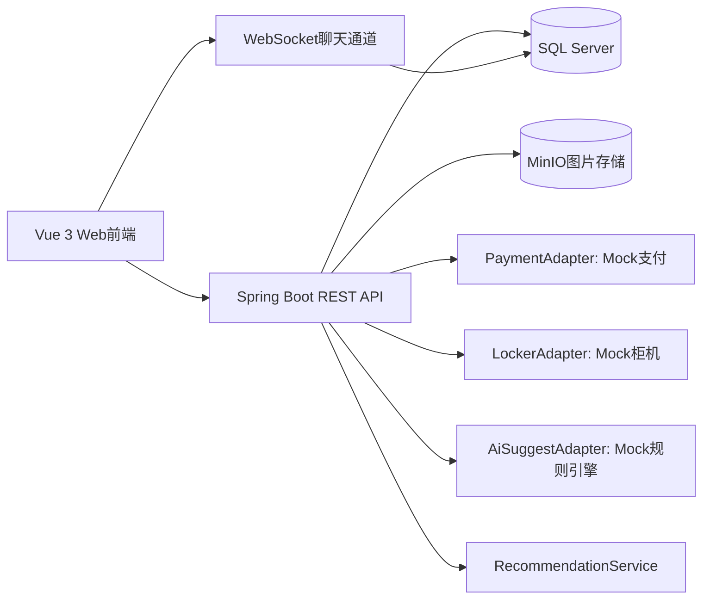
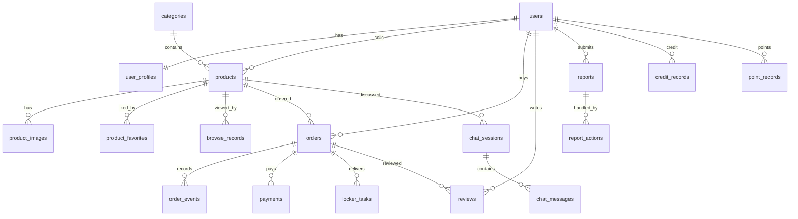

# T-02 SwapCampus D4-D5 概要设计、详细设计、数据库设计与接口草案

版本：v1.0
日期：2026-06-03
适用范围：概要设计、详细设计、SQL Server 数据库设计、REST/WebSocket 接口草案

## 1. 总体架构

系统采用“模块化单体 + 适配器接口”的架构。课程阶段保持一个 Spring Boot 后端服务，按业务边界拆包；支付、柜机、AI 建议等外部依赖通过接口适配器隔离，默认使用 Mock 实现。前端使用 Vue 3 单页应用，后台管理与用户端共用登录态和 API SDK。



### 1.1 技术栈

| 层次 | 选型 |
| --- | --- |
| 前端 | Vue 3 + Vite + TypeScript + Element Plus + Pinia + Vue Router |
| 后端 | Spring Boot 3 + Spring Security + JWT + MyBatis-Plus |
| 数据库 | SQL Server 2022 Developer/Express，使用 SSMS 管理 |
| 对象存储 | MinIO，本地 Docker 部署 |
| 即时通讯 | Spring WebSocket，失败时短轮询 |
| API 文档 | OpenAPI/Swagger + Apifox/Postman |
| 测试 | JUnit 5 + Mockito + k6 |
| 部署 | Docker Compose；SQL Server 可本地安装或容器化 |

### 1.2 分层约定

```text
controller -> application service -> domain service -> repository/mapper -> database
                              -> adapter interface -> mock/real provider
```

- Controller 只处理鉴权、参数校验、DTO 转换和 HTTP 状态码。
- Application Service 编排业务流程，例如下单、支付、柜机寄件。
- Domain Service 维护核心规则，例如订单状态机、信用分计算。
- Mapper/Repository 负责 SQL Server 读写。
- Adapter 隔离外部服务，默认 Mock 实现。

## 2. 后端模块设计

建议包名：`com.swapcampus`

| 模块 | 包名 | 责任 | 可分配 agent |
| --- | --- | --- | --- |
| auth | `auth` | 登录、注册、JWT、密码加密、角色鉴权 | 后端 A |
| user | `user` | 用户资料、实名验证、信用分、积分任务 | 后端 A |
| product | `product` | 商品、分类、标签、图片、审核状态 | 后端 B |
| search | `search` | 搜索、筛选、浏览记录 | 后端 B |
| recommend | `recommend` | 个性化推荐流 | 后端 B |
| order | `order` | 下单、状态机、订单事件、评价入口 | 后端 C |
| payment | `payment` | 模拟支付、退款、支付流水、支付适配器 | 后端 C |
| delivery | `delivery` | 面交、柜机任务、柜机适配器 | 后端 C |
| chat | `chat` | 会话、消息、WebSocket、未读数 | 后端 D |
| review | `review` | 交易评价、信用分更新 | 后端 C |
| report | `report` | 举报、证据、处理记录 | 后端 D |
| admin | `admin` | 后台审核、用户管理、数据看板 | 后端 D |
| ai | `ai` | 自动分类、定价建议适配器 | 后端 B |
| audit | `audit` | 审计日志、操作追踪 | 后端 A |
| common | `common` | 统一响应、异常、枚举、工具类 | 架构/组长 |

## 3. 前端模块设计

建议目录：

```text
frontend/src
  api/              // REST API SDK
  assets/
  components/       // 通用组件
  layouts/          // 用户端/管理端布局
  router/
  stores/           // Pinia stores
  views/
    auth/
    home/
    product/
    order/
    chat/
    profile/
    points/
    admin/
  utils/
```

核心路由：

| 路由 | 页面 |
| --- | --- |
| `/login` | 登录/注册 |
| `/verify` | 学号实名验证 |
| `/` | 首页商品流/推荐流 |
| `/products` | 商品搜索列表 |
| `/products/:id` | 商品详情 |
| `/products/new` | 发布商品 |
| `/orders` | 我的订单 |
| `/orders/:id` | 订单详情 |
| `/chat` | 聊天 |
| `/profile/:id` | 个人主页 |
| `/points` | 签到任务与兑换 |
| `/admin` | 管理后台看板 |
| `/admin/products` | 商品审核 |
| `/admin/reports` | 举报处理 |
| `/admin/users` | 用户管理 |
| `/admin/lockers` | 柜机配置 |

## 4. 核心业务详细设计

### 4.1 学号实名验证

默认使用沙箱验证，不连接学校真实系统。

规则：

- 学号格式：8-12 位数字或学校约定前缀。
- 姓名非空，学院来自配置表。
- 同一学号只能绑定一个启用账号。
- 验证通过后写入 `user_profiles.verified_at`，并写入审计日志。

### 4.2 商品状态机

```text
DRAFT -> PENDING_REVIEW -> ACTIVE -> LOCKED -> SOLD
                |             |       |
                v             v       v
           REVIEW_REJECTED   OFFLINE  OFFLINE
```

规则：

- `ACTIVE` 商品才可被搜索和下单。
- 买家创建有效订单后商品进入 `LOCKED`。
- 订单取消或关闭后商品回到 `ACTIVE`。
- 订单完成后商品进入 `SOLD`。

### 4.3 订单状态机

```text
CREATED -> SELLER_CONFIRMED -> PAYMENT_PENDING -> PAID -> DELIVERY_PENDING -> RECEIVED -> COMPLETED
```

异常：

```text
CANCELLED, REFUNDING, REFUNDED, DISPUTED, CLOSED
```

状态推进规则：

| 当前状态 | 动作 | 下一状态 |
| --- | --- | --- |
| CREATED | 卖家确认 | SELLER_CONFIRMED |
| CREATED | 买家/卖家取消 | CANCELLED |
| SELLER_CONFIRMED | 创建支付单 | PAYMENT_PENDING |
| PAYMENT_PENDING | 支付成功 | PAID |
| PAID | 选择交付方式 | DELIVERY_PENDING |
| DELIVERY_PENDING | 买家确认收货/取件成功 | RECEIVED |
| RECEIVED | 双方评价或自动完成 | COMPLETED |
| 任意进行中 | 举报争议成立 | DISPUTED |
| DISPUTED | 管理员关闭 | CLOSED |

### 4.4 支付适配器

接口：

```java
public interface PaymentAdapter {
    PaymentCreateResult createPayment(PaymentCreateCommand command);
    PaymentQueryResult queryPayment(String providerTradeNo);
    RefundResult refund(RefundCommand command);
}
```

默认实现：`MockPaymentAdapter`

- 创建支付单时返回模拟支付链接或二维码文本。
- 调用确认支付接口后直接置为 `SUCCESS`。
- 退款接口按支付金额生成退款流水。
- 所有支付事件写入 `payments` 与 `payment_events`。

后续真实接入只新增 `AlipayPaymentAdapter`、`WechatPaymentAdapter` 或校园卡适配器，不改订单主流程。

### 4.5 柜机适配器

接口：

```java
public interface LockerAdapter {
    LockerReserveResult reserveBox(LockerReserveCommand command);
    LockerStoreResult confirmStored(String lockerTaskNo);
    LockerPickupResult confirmPickedUp(String lockerTaskNo, String pickupCode);
}
```

默认实现：`MockLockerAdapter`

- 预约时从 `locker_boxes` 中选择空闲柜门。
- 返回寄件二维码文本、取件码、柜机位置。
- 扫码寄件、扫码取件由前端按钮模拟触发。
- 状态写入 `locker_tasks` 与 `order_events`。

### 4.6 AI 分类与定价建议

接口：

```java
public interface AiSuggestAdapter {
    AiSuggestResult suggest(AiSuggestCommand command);
}
```

默认规则：

- 标题包含“教材/高数/英语/考研” -> 教材分类。
- 标题包含“耳机/键盘/手机/平板” -> 数码分类。
- 根据同分类最近成交均价、商品成色折扣给出价格区间。
- 结果写入 `ai_suggestion_logs`，便于展示。

### 4.7 推荐算法

课程阶段采用可解释的加权分数：

```text
score =
  分类偏好 * 0.35 +
  标签匹配 * 0.20 +
  卖家信用 * 0.15 +
  商品热度 * 0.15 +
  新鲜度 * 0.15
```

数据来源：

- 浏览记录：`browse_records`
- 收藏记录：`product_favorites`
- 订单记录：`orders`
- 商品热度：浏览数、收藏数、聊天数

无历史用户返回热门商品和最新商品混合流。

### 4.8 信用分与游戏化积分

信用分用于可信度，积分用于游戏化兑换，两者分离。

信用分规则：

| 事件 | 分值 |
| --- | --- |
| 完成交易 | +2 |
| 获得好评 | +1 |
| 有效举报 | -5 |
| 违规商品下架 | -10 |
| 爽约/恶意取消 | -3 |

积分规则：

| 任务 | 积分 |
| --- | --- |
| 每日签到 | +10 |
| 完善资料 | +20 |
| 首次发布商品 | +50 |
| 首次成交 | +100 |
| 收到好评 | +20 |

所有变化分别写入 `credit_records`、`point_records`。

## 5. 数据库设计

数据库：`SwapCampus`
目标数据库：SQL Server 2022 Developer/Express
管理工具：SQL Server Management Studio
主键建议：`BIGINT IDENTITY(1,1)`，避免课程开发中 UUID 调试不便。
时间字段：统一 `DATETIME2(0)`。
金额字段：统一 `DECIMAL(10,2)`。
软删除：核心业务表使用 `is_deleted BIT`。

### 5.1 ER 图



### 5.2 表清单

| 表名 | 用途 |
| --- | --- |
| `users` | 用户基础账号 |
| `user_profiles` | 实名资料与个人资料 |
| `credit_records` | 信用分流水 |
| `point_records` | 游戏化积分流水 |
| `point_tasks` | 积分任务配置 |
| `point_redemptions` | 积分兑换记录 |
| `categories` | 商品分类 |
| `tags` | 商品标签 |
| `product_tags` | 商品标签关系 |
| `products` | 商品主表 |
| `product_images` | 商品图片 |
| `product_favorites` | 收藏 |
| `browse_records` | 浏览记录 |
| `orders` | 订单主表 |
| `order_events` | 订单事件 |
| `payments` | 支付单 |
| `payment_events` | 支付事件 |
| `locker_stations` | 柜机站点 |
| `locker_boxes` | 柜门 |
| `locker_tasks` | 柜机寄取任务 |
| `chat_sessions` | 聊天会话 |
| `chat_messages` | 聊天消息 |
| `reviews` | 评价 |
| `reports` | 举报 |
| `report_actions` | 举报处理动作 |
| `ai_suggestion_logs` | AI 建议记录 |
| `audit_logs` | 审计日志 |

### 5.3 SQL Server DDL 草案

```sql
CREATE DATABASE SwapCampus;
GO
USE SwapCampus;
GO

CREATE TABLE users (
  id BIGINT IDENTITY(1,1) PRIMARY KEY,
  username NVARCHAR(50) NOT NULL UNIQUE,
  password_hash NVARCHAR(100) NOT NULL,
  phone NVARCHAR(20) NULL,
  email NVARCHAR(100) NULL,
  role NVARCHAR(20) NOT NULL DEFAULT 'USER',
  status NVARCHAR(20) NOT NULL DEFAULT 'ACTIVE',
  credit_score INT NOT NULL DEFAULT 60,
  point_balance INT NOT NULL DEFAULT 0,
  created_at DATETIME2(0) NOT NULL DEFAULT SYSDATETIME(),
  updated_at DATETIME2(0) NOT NULL DEFAULT SYSDATETIME(),
  is_deleted BIT NOT NULL DEFAULT 0
);

CREATE TABLE user_profiles (
  user_id BIGINT PRIMARY KEY,
  real_name NVARCHAR(50) NULL,
  student_no NVARCHAR(30) NULL UNIQUE,
  college NVARCHAR(80) NULL,
  grade NVARCHAR(20) NULL,
  avatar_url NVARCHAR(500) NULL,
  bio NVARCHAR(500) NULL,
  verified_at DATETIME2(0) NULL,
  contact_masked NVARCHAR(100) NULL,
  CONSTRAINT fk_user_profiles_user FOREIGN KEY (user_id) REFERENCES users(id)
);

CREATE TABLE categories (
  id BIGINT IDENTITY(1,1) PRIMARY KEY,
  parent_id BIGINT NULL,
  name NVARCHAR(50) NOT NULL,
  sort_order INT NOT NULL DEFAULT 0,
  status NVARCHAR(20) NOT NULL DEFAULT 'ACTIVE'
);

CREATE TABLE tags (
  id BIGINT IDENTITY(1,1) PRIMARY KEY,
  name NVARCHAR(50) NOT NULL UNIQUE,
  status NVARCHAR(20) NOT NULL DEFAULT 'ACTIVE'
);

CREATE TABLE products (
  id BIGINT IDENTITY(1,1) PRIMARY KEY,
  seller_id BIGINT NOT NULL,
  category_id BIGINT NOT NULL,
  title NVARCHAR(120) NOT NULL,
  description NVARCHAR(MAX) NULL,
  price DECIMAL(10,2) NOT NULL,
  original_price DECIMAL(10,2) NULL,
  condition_level NVARCHAR(20) NOT NULL,
  campus NVARCHAR(50) NULL,
  trade_modes NVARCHAR(100) NOT NULL DEFAULT 'MEETUP',
  status NVARCHAR(30) NOT NULL DEFAULT 'DRAFT',
  view_count INT NOT NULL DEFAULT 0,
  favorite_count INT NOT NULL DEFAULT 0,
  audit_reason NVARCHAR(300) NULL,
  created_at DATETIME2(0) NOT NULL DEFAULT SYSDATETIME(),
  updated_at DATETIME2(0) NOT NULL DEFAULT SYSDATETIME(),
  is_deleted BIT NOT NULL DEFAULT 0,
  CONSTRAINT fk_products_seller FOREIGN KEY (seller_id) REFERENCES users(id),
  CONSTRAINT fk_products_category FOREIGN KEY (category_id) REFERENCES categories(id)
);

CREATE TABLE product_images (
  id BIGINT IDENTITY(1,1) PRIMARY KEY,
  product_id BIGINT NOT NULL,
  url NVARCHAR(500) NOT NULL,
  sort_order INT NOT NULL DEFAULT 0,
  created_at DATETIME2(0) NOT NULL DEFAULT SYSDATETIME(),
  CONSTRAINT fk_product_images_product FOREIGN KEY (product_id) REFERENCES products(id)
);

CREATE TABLE product_tags (
  product_id BIGINT NOT NULL,
  tag_id BIGINT NOT NULL,
  PRIMARY KEY (product_id, tag_id),
  CONSTRAINT fk_product_tags_product FOREIGN KEY (product_id) REFERENCES products(id),
  CONSTRAINT fk_product_tags_tag FOREIGN KEY (tag_id) REFERENCES tags(id)
);

CREATE TABLE product_favorites (
  user_id BIGINT NOT NULL,
  product_id BIGINT NOT NULL,
  created_at DATETIME2(0) NOT NULL DEFAULT SYSDATETIME(),
  PRIMARY KEY (user_id, product_id),
  CONSTRAINT fk_product_favorites_user FOREIGN KEY (user_id) REFERENCES users(id),
  CONSTRAINT fk_product_favorites_product FOREIGN KEY (product_id) REFERENCES products(id)
);

CREATE TABLE browse_records (
  id BIGINT IDENTITY(1,1) PRIMARY KEY,
  user_id BIGINT NULL,
  product_id BIGINT NOT NULL,
  category_id BIGINT NULL,
  created_at DATETIME2(0) NOT NULL DEFAULT SYSDATETIME(),
  CONSTRAINT fk_browse_product FOREIGN KEY (product_id) REFERENCES products(id)
);

CREATE TABLE orders (
  id BIGINT IDENTITY(1,1) PRIMARY KEY,
  order_no NVARCHAR(40) NOT NULL UNIQUE,
  product_id BIGINT NOT NULL,
  buyer_id BIGINT NOT NULL,
  seller_id BIGINT NOT NULL,
  amount DECIMAL(10,2) NOT NULL,
  status NVARCHAR(30) NOT NULL DEFAULT 'CREATED',
  trade_mode NVARCHAR(20) NOT NULL DEFAULT 'MEETUP',
  created_at DATETIME2(0) NOT NULL DEFAULT SYSDATETIME(),
  updated_at DATETIME2(0) NOT NULL DEFAULT SYSDATETIME(),
  completed_at DATETIME2(0) NULL,
  CONSTRAINT fk_orders_product FOREIGN KEY (product_id) REFERENCES products(id),
  CONSTRAINT fk_orders_buyer FOREIGN KEY (buyer_id) REFERENCES users(id),
  CONSTRAINT fk_orders_seller FOREIGN KEY (seller_id) REFERENCES users(id)
);

CREATE TABLE order_events (
  id BIGINT IDENTITY(1,1) PRIMARY KEY,
  order_id BIGINT NOT NULL,
  from_status NVARCHAR(30) NULL,
  to_status NVARCHAR(30) NOT NULL,
  event_type NVARCHAR(50) NOT NULL,
  operator_id BIGINT NULL,
  note NVARCHAR(300) NULL,
  created_at DATETIME2(0) NOT NULL DEFAULT SYSDATETIME(),
  CONSTRAINT fk_order_events_order FOREIGN KEY (order_id) REFERENCES orders(id)
);

CREATE TABLE payments (
  id BIGINT IDENTITY(1,1) PRIMARY KEY,
  payment_no NVARCHAR(40) NOT NULL UNIQUE,
  order_id BIGINT NOT NULL,
  provider NVARCHAR(30) NOT NULL DEFAULT 'MOCK',
  provider_trade_no NVARCHAR(80) NULL,
  amount DECIMAL(10,2) NOT NULL,
  status NVARCHAR(30) NOT NULL DEFAULT 'CREATED',
  pay_url NVARCHAR(500) NULL,
  paid_at DATETIME2(0) NULL,
  created_at DATETIME2(0) NOT NULL DEFAULT SYSDATETIME(),
  CONSTRAINT fk_payments_order FOREIGN KEY (order_id) REFERENCES orders(id)
);

CREATE TABLE payment_events (
  id BIGINT IDENTITY(1,1) PRIMARY KEY,
  payment_id BIGINT NOT NULL,
  event_type NVARCHAR(50) NOT NULL,
  payload NVARCHAR(MAX) NULL,
  created_at DATETIME2(0) NOT NULL DEFAULT SYSDATETIME(),
  CONSTRAINT fk_payment_events_payment FOREIGN KEY (payment_id) REFERENCES payments(id)
);

CREATE TABLE locker_stations (
  id BIGINT IDENTITY(1,1) PRIMARY KEY,
  name NVARCHAR(80) NOT NULL,
  location NVARCHAR(200) NOT NULL,
  status NVARCHAR(20) NOT NULL DEFAULT 'ACTIVE'
);

CREATE TABLE locker_boxes (
  id BIGINT IDENTITY(1,1) PRIMARY KEY,
  station_id BIGINT NOT NULL,
  box_no NVARCHAR(30) NOT NULL,
  size NVARCHAR(20) NOT NULL DEFAULT 'M',
  status NVARCHAR(20) NOT NULL DEFAULT 'EMPTY',
  CONSTRAINT fk_locker_boxes_station FOREIGN KEY (station_id) REFERENCES locker_stations(id)
);

CREATE TABLE locker_tasks (
  id BIGINT IDENTITY(1,1) PRIMARY KEY,
  task_no NVARCHAR(40) NOT NULL UNIQUE,
  order_id BIGINT NOT NULL,
  station_id BIGINT NOT NULL,
  box_id BIGINT NOT NULL,
  pickup_code NVARCHAR(20) NOT NULL,
  status NVARCHAR(30) NOT NULL DEFAULT 'RESERVED',
  stored_at DATETIME2(0) NULL,
  picked_up_at DATETIME2(0) NULL,
  created_at DATETIME2(0) NOT NULL DEFAULT SYSDATETIME(),
  CONSTRAINT fk_locker_tasks_order FOREIGN KEY (order_id) REFERENCES orders(id)
);

CREATE TABLE chat_sessions (
  id BIGINT IDENTITY(1,1) PRIMARY KEY,
  product_id BIGINT NULL,
  order_id BIGINT NULL,
  buyer_id BIGINT NOT NULL,
  seller_id BIGINT NOT NULL,
  last_message_at DATETIME2(0) NULL,
  created_at DATETIME2(0) NOT NULL DEFAULT SYSDATETIME()
);

CREATE TABLE chat_messages (
  id BIGINT IDENTITY(1,1) PRIMARY KEY,
  session_id BIGINT NOT NULL,
  sender_id BIGINT NOT NULL,
  message_type NVARCHAR(20) NOT NULL DEFAULT 'TEXT',
  content NVARCHAR(MAX) NOT NULL,
  image_url NVARCHAR(500) NULL,
  read_at DATETIME2(0) NULL,
  created_at DATETIME2(0) NOT NULL DEFAULT SYSDATETIME(),
  CONSTRAINT fk_chat_messages_session FOREIGN KEY (session_id) REFERENCES chat_sessions(id)
);

CREATE TABLE reviews (
  id BIGINT IDENTITY(1,1) PRIMARY KEY,
  order_id BIGINT NOT NULL,
  reviewer_id BIGINT NOT NULL,
  reviewee_id BIGINT NOT NULL,
  rating INT NOT NULL,
  content NVARCHAR(500) NULL,
  created_at DATETIME2(0) NOT NULL DEFAULT SYSDATETIME(),
  CONSTRAINT fk_reviews_order FOREIGN KEY (order_id) REFERENCES orders(id)
);

CREATE TABLE reports (
  id BIGINT IDENTITY(1,1) PRIMARY KEY,
  reporter_id BIGINT NOT NULL,
  target_type NVARCHAR(30) NOT NULL,
  target_id BIGINT NOT NULL,
  reason NVARCHAR(100) NOT NULL,
  description NVARCHAR(1000) NULL,
  status NVARCHAR(30) NOT NULL DEFAULT 'PENDING',
  created_at DATETIME2(0) NOT NULL DEFAULT SYSDATETIME()
);

CREATE TABLE report_actions (
  id BIGINT IDENTITY(1,1) PRIMARY KEY,
  report_id BIGINT NOT NULL,
  admin_id BIGINT NOT NULL,
  action_type NVARCHAR(50) NOT NULL,
  note NVARCHAR(500) NULL,
  created_at DATETIME2(0) NOT NULL DEFAULT SYSDATETIME(),
  CONSTRAINT fk_report_actions_report FOREIGN KEY (report_id) REFERENCES reports(id)
);

CREATE TABLE credit_records (
  id BIGINT IDENTITY(1,1) PRIMARY KEY,
  user_id BIGINT NOT NULL,
  delta INT NOT NULL,
  score_after INT NOT NULL,
  reason NVARCHAR(100) NOT NULL,
  ref_type NVARCHAR(30) NULL,
  ref_id BIGINT NULL,
  created_at DATETIME2(0) NOT NULL DEFAULT SYSDATETIME(),
  CONSTRAINT fk_credit_records_user FOREIGN KEY (user_id) REFERENCES users(id)
);

CREATE TABLE point_tasks (
  id BIGINT IDENTITY(1,1) PRIMARY KEY,
  code NVARCHAR(50) NOT NULL UNIQUE,
  name NVARCHAR(80) NOT NULL,
  reward_points INT NOT NULL,
  task_type NVARCHAR(30) NOT NULL,
  status NVARCHAR(20) NOT NULL DEFAULT 'ACTIVE'
);

CREATE TABLE point_records (
  id BIGINT IDENTITY(1,1) PRIMARY KEY,
  user_id BIGINT NOT NULL,
  delta INT NOT NULL,
  balance_after INT NOT NULL,
  reason NVARCHAR(100) NOT NULL,
  ref_type NVARCHAR(30) NULL,
  ref_id BIGINT NULL,
  created_at DATETIME2(0) NOT NULL DEFAULT SYSDATETIME(),
  CONSTRAINT fk_point_records_user FOREIGN KEY (user_id) REFERENCES users(id)
);

CREATE TABLE point_redemptions (
  id BIGINT IDENTITY(1,1) PRIMARY KEY,
  user_id BIGINT NOT NULL,
  item_code NVARCHAR(50) NOT NULL,
  item_name NVARCHAR(80) NOT NULL,
  cost_points INT NOT NULL,
  status NVARCHAR(20) NOT NULL DEFAULT 'SUCCESS',
  created_at DATETIME2(0) NOT NULL DEFAULT SYSDATETIME()
);

CREATE TABLE ai_suggestion_logs (
  id BIGINT IDENTITY(1,1) PRIMARY KEY,
  user_id BIGINT NOT NULL,
  title NVARCHAR(120) NOT NULL,
  input_summary NVARCHAR(1000) NULL,
  suggested_category_id BIGINT NULL,
  suggested_tags NVARCHAR(300) NULL,
  suggested_min_price DECIMAL(10,2) NULL,
  suggested_max_price DECIMAL(10,2) NULL,
  provider NVARCHAR(30) NOT NULL DEFAULT 'MOCK',
  created_at DATETIME2(0) NOT NULL DEFAULT SYSDATETIME()
);

CREATE TABLE audit_logs (
  id BIGINT IDENTITY(1,1) PRIMARY KEY,
  operator_id BIGINT NULL,
  action NVARCHAR(80) NOT NULL,
  target_type NVARCHAR(30) NULL,
  target_id BIGINT NULL,
  detail NVARCHAR(MAX) NULL,
  ip NVARCHAR(50) NULL,
  created_at DATETIME2(0) NOT NULL DEFAULT SYSDATETIME()
);

CREATE INDEX idx_products_search ON products(status, category_id, price, created_at);
CREATE INDEX idx_orders_buyer ON orders(buyer_id, created_at);
CREATE INDEX idx_orders_seller ON orders(seller_id, created_at);
CREATE INDEX idx_chat_messages_session ON chat_messages(session_id, created_at);
CREATE INDEX idx_browse_records_user ON browse_records(user_id, created_at);
```

## 6. 接口草案

统一响应：

```json
{
  "code": 0,
  "message": "ok",
  "data": {}
}
```

分页响应：

```json
{
  "code": 0,
  "message": "ok",
  "data": {
    "items": [],
    "page": 1,
    "pageSize": 20,
    "total": 200
  }
}
```

### 6.1 Auth/User

| 方法 | 路径 | 说明 |
| --- | --- | --- |
| POST | `/api/auth/register` | 注册 |
| POST | `/api/auth/login` | 登录 |
| POST | `/api/auth/logout` | 登出 |
| GET | `/api/users/me` | 当前用户信息 |
| PUT | `/api/users/me/profile` | 更新资料 |
| POST | `/api/users/me/verify-student` | 学号实名验证 |
| GET | `/api/users/{id}` | 用户主页 |
| GET | `/api/users/me/credit-records` | 信用分流水 |

### 6.2 商品、搜索、推荐、AI

| 方法 | 路径 | 说明 |
| --- | --- | --- |
| GET | `/api/categories` | 分类树 |
| GET | `/api/tags` | 标签列表 |
| POST | `/api/products` | 发布商品 |
| PUT | `/api/products/{id}` | 编辑商品 |
| GET | `/api/products/{id}` | 商品详情 |
| GET | `/api/products` | 搜索/筛选商品 |
| POST | `/api/products/{id}/images` | 上传商品图片 |
| POST | `/api/products/{id}/favorite` | 收藏 |
| DELETE | `/api/products/{id}/favorite` | 取消收藏 |
| POST | `/api/products/{id}/view` | 记录浏览 |
| GET | `/api/recommendations` | 个性化推荐流 |
| POST | `/api/ai/product-suggestions` | AI 分类与定价建议 |

商品搜索参数：

```text
keyword, categoryId, minPrice, maxPrice, conditionLevel, campus, tradeMode, sort, page, pageSize
```

AI 建议请求：

```json
{
  "title": "九成新高等数学教材",
  "description": "无笔记，适合大一课程",
  "conditionLevel": "LIKE_NEW"
}
```

### 6.3 订单、支付、交付

| 方法 | 路径 | 说明 |
| --- | --- | --- |
| POST | `/api/orders` | 创建订单 |
| GET | `/api/orders` | 我的订单列表 |
| GET | `/api/orders/{id}` | 订单详情 |
| POST | `/api/orders/{id}/seller-confirm` | 卖家确认订单 |
| POST | `/api/orders/{id}/cancel` | 取消订单 |
| POST | `/api/orders/{id}/payments` | 创建支付单 |
| POST | `/api/payments/{id}/mock-confirm` | 模拟支付成功 |
| POST | `/api/payments/{id}/refund` | 申请/执行退款 |
| POST | `/api/orders/{id}/delivery/meetup-confirm` | 面交确认 |
| POST | `/api/orders/{id}/delivery/locker-reserve` | 预约柜机 |
| POST | `/api/locker-tasks/{id}/mock-store` | 模拟扫码寄件 |
| POST | `/api/locker-tasks/{id}/mock-pickup` | 模拟扫码取件 |
| POST | `/api/orders/{id}/reviews` | 提交评价 |

创建订单请求：

```json
{
  "productId": 1001,
  "tradeMode": "LOCKER",
  "remark": "希望明天下午前完成"
}
```

创建支付单响应：

```json
{
  "paymentId": 9001,
  "paymentNo": "PAY202606030001",
  "provider": "MOCK",
  "amount": 99.00,
  "status": "CREATED",
  "payUrl": "mockpay://PAY202606030001"
}
```

### 6.4 聊天

| 方法 | 路径 | 说明 |
| --- | --- | --- |
| POST | `/api/chat/sessions` | 创建/获取会话 |
| GET | `/api/chat/sessions` | 会话列表 |
| GET | `/api/chat/sessions/{id}/messages` | 消息列表 |
| POST | `/api/chat/sessions/{id}/messages` | 发送消息，轮询降级 |
| POST | `/api/chat/sessions/{id}/read` | 标记已读 |
| WS | `/ws/chat` | WebSocket 消息通道 |

WebSocket 消息：

```json
{
  "type": "CHAT_MESSAGE",
  "sessionId": 1,
  "messageType": "TEXT",
  "content": "明天下午北门可以吗？"
}
```

### 6.5 举报与后台

| 方法 | 路径 | 说明 |
| --- | --- | --- |
| POST | `/api/reports` | 提交举报 |
| GET | `/api/admin/dashboard` | 数据看板 |
| GET | `/api/admin/products/pending` | 待审核商品 |
| POST | `/api/admin/products/{id}/approve` | 审核通过 |
| POST | `/api/admin/products/{id}/reject` | 审核拒绝 |
| GET | `/api/admin/reports` | 举报列表 |
| POST | `/api/admin/reports/{id}/actions` | 处理举报 |
| GET | `/api/admin/users` | 用户列表 |
| POST | `/api/admin/users/{id}/ban` | 封禁用户 |
| POST | `/api/admin/users/{id}/unban` | 解封用户 |
| GET | `/api/admin/audit-logs` | 审计日志 |
| CRUD | `/api/admin/locker-stations` | 柜机站点维护 |
| CRUD | `/api/admin/categories` | 分类维护 |
| CRUD | `/api/admin/tags` | 标签维护 |

### 6.6 积分任务

| 方法 | 路径 | 说明 |
| --- | --- | --- |
| POST | `/api/points/check-in` | 每日签到 |
| GET | `/api/points/tasks` | 任务列表 |
| POST | `/api/points/tasks/{code}/claim` | 领取任务奖励 |
| GET | `/api/points/records` | 积分流水 |
| GET | `/api/points/items` | 可兑换权益 |
| POST | `/api/points/redeem` | 兑换权益 |

## 7. 权限矩阵

| 功能 | 游客 | 已登录 | 已实名 | 管理员 |
| --- | --- | --- | --- | --- |
| 浏览商品 | 是 | 是 | 是 | 是 |
| 收藏/聊天 | 否 | 是 | 是 | 是 |
| 发布/下单/支付 | 否 | 否 | 是 | 是 |
| 评价/举报 | 否 | 否 | 是 | 是 |
| 后台管理 | 否 | 否 | 否 | 是 |

## 8. 测试重点

| 模块 | 必测点 |
| --- | --- |
| auth/user | 注册登录、JWT 过期、实名唯一性 |
| product | 发布、审核、上下架、图片上传 |
| order | 状态机合法流转、商品锁定、取消解锁 |
| payment | 创建支付、模拟支付成功、退款 |
| delivery | 面交确认、柜机预约、寄件、取件 |
| chat | 消息发送、未读数、WebSocket 推送 |
| report | 举报提交、处理动作、扣信用分 |
| credit/points | 信用分流水、签到幂等、兑换扣减 |
| recommend/ai | 冷启动推荐、规则建议、日志记录 |

## 9. 交付优先级

P0 必须先完成：

- 登录注册、实名、商品发布审核、搜索详情、下单、模拟支付、面交完成、评价。

P1 推荐并行完成：

- 聊天、举报后台、MinIO 图片、SQL Server 种子数据、数据看板。

P2 附加项：

- 推荐流、AI 建议、柜机中转、签到任务兑换。

由于附加项已纳入数据库和接口，P2 可以由独立 agent 在主流程稳定后补实现，不需要重构核心订单链路。
